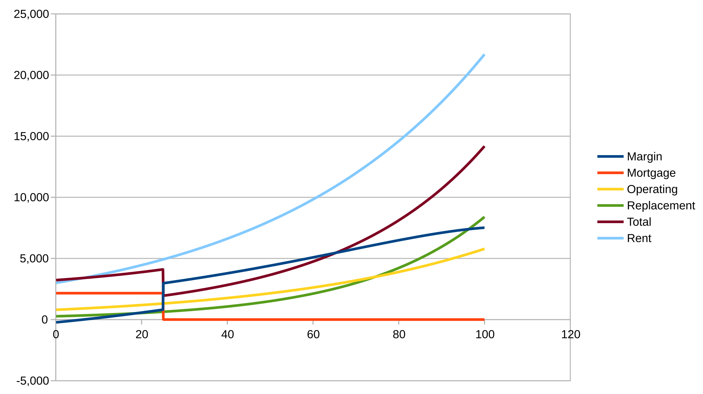
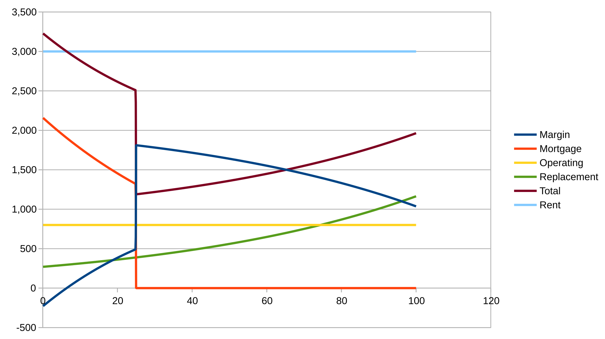

### Charts

The charts are about cash flow, they do not include more complex calculations of profit and loss.

#### Graph of nominal dollar flows

The nominal dollar chart is best interpreted as the history of a typical rental project.

#### Graph of constant dollar flows

The constant dollar chart is best interpreted as the typical cash flow this year of a unit built that many years ago.

