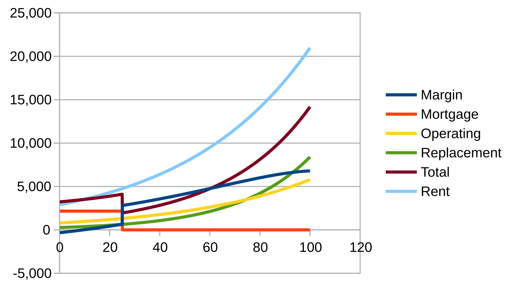
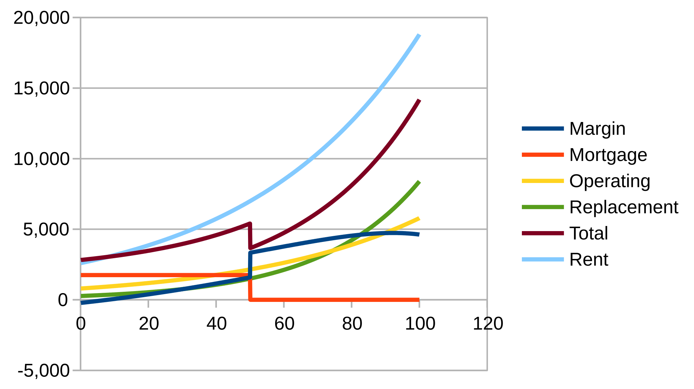
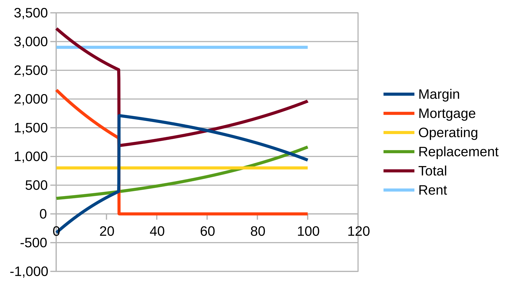
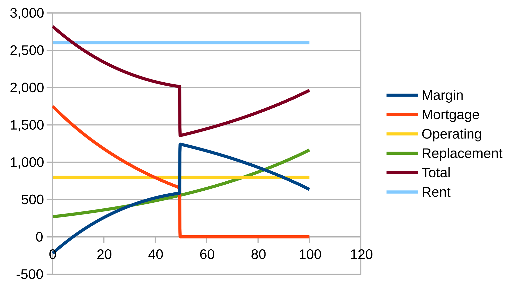

### Charts

The charts are about cash flow, they do not include more complex calculations of profit and loss.

#### Graphs of nominal dollar flows

The nominal dollar charts are best interpreted as the history of a typical rental project.

Here is the first option: $2,900 rent and 25 year amortization period.

Here is the second option: $2,600 rent and 50 year amortization period.

#### Graphs of constant dollar flows

The constant dollar charts are best interpreted as the typical cash flow this year of a unit built that many years ago.

Here is the first option: $2,900 rent and 25 year amortization period.

Here is the second option: $2,600 rent and 50 year amortization period.

