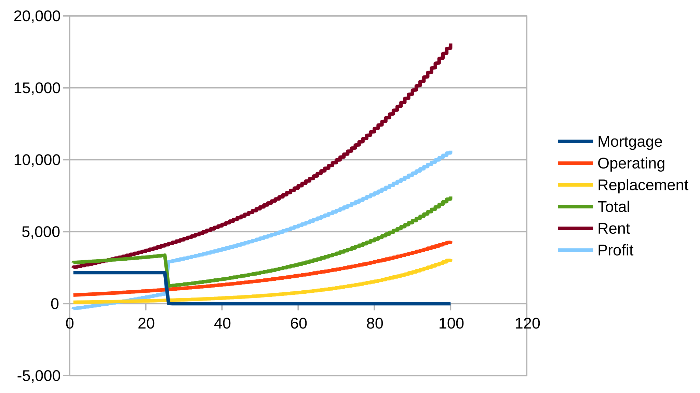
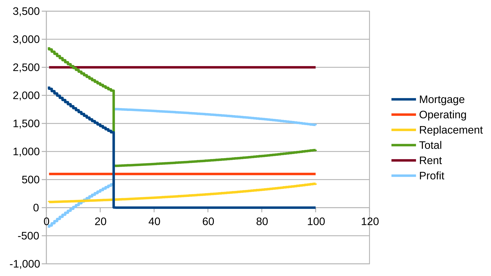

# Economics

## Introduction

This paper does two things.

It decribes a high level model of cost and rents for rental buildings. It only deals with buildings with relatively high attractiveness (near median rents and above), since those are the ones wirh policy salience. 

A fundamental assumption is that building life is measured in decades or centuries.



### Charts

The charts are about cash flow.  

The rent estimates (start just below costs and increase by the inflation rate) are very conservative.

The nominal dollar chart is best interpreted as the history of a typical rental project.

The constant dollar chart is best interpreted as the typical cash flow this year of a unit built that many years ago.

